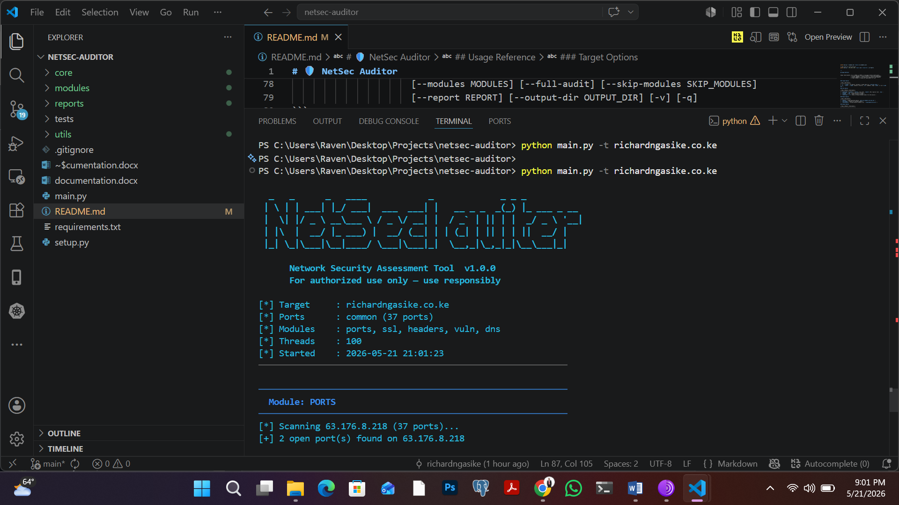

# 🛡️ NetSec Auditor


Network security assessment tool written in pure Python by Richard Ngasike

## Screenshot

<p align="center">
  
</p>

NetSec Auditor is a modular, extensible command-line tool designed for authorized security assessments of networked hosts and infrastructure. It performs port scanning, SSL/TLS analysis, HTTP security header checks, DNS enumeration, SSH auditing, and known vulnerability detection — then outputs professional reports in console, JSON, and HTML formats.

> ⚠️ Legal Notice: This tool must only be used on systems you own or have explicit written authorization to test. Unauthorized scanning is illegal under the Computer Fraud and Abuse Act, the Computer Misuse Act (KE), and equivalent laws worldwide.

---

## Features

| Module | What it checks |
|--------|---------------|
| Port Scanner | TCP port discovery with concurrent threading, service fingerprinting, banner grabbing, and dangerous-port flagging |
| SSL/TLS Analyzer | Certificate expiry, self-signed certs, deprecated TLS 1.0/1.1 protocols, weak cipher suites |
| HTTP Headers | HSTS, CSP, X-Frame-Options, X-Content-Type-Options, Referrer-Policy, Permissions-Policy, information disclosure |
| DNS Enumerator | Zone transfer (AXFR), subdomain enumeration, SPF/DMARC email security record checks |
| Vulnerability Checker | Signature-based CVE detection (vsftpd backdoor, OpenSSH RCE, EternalBlue, Redis/Mongo/Elasticsearch exposure) |
| SSH Auditor | Version detection, SSHv1 check, weak KEX/MAC/cipher algorithm detection |

Reports: Console (colored), JSON (CI/CD-ready), HTML (self-contained, shareable)

---

## Requirements

- Python 3.9+ (stdlib only — no pip install required for core functionality)
- `dig` (optional — used for DNS zone transfer and SPF/DMARC checks; install via `bind-utils` or `dnsutils`)

---

## Installation

```bash
# Clone the repository
git clone https://github.com/yourorg/netsec-auditor.git
cd netsec-auditor

# No dependencies needed for core scanning!
# Optional: install dev/test dependencies
pip install -r requirements.txt

# Make the entry point executable
chmod +x main.py OR python main.py in windowa
```

---

## Quick Start

```bash
# Scan a single host with common ports, all modules
python main.py -t example.com

# Scan specific ports
python main.py -t 192.168.1.1 --ports 22,80,443,3306,6379

# Full audit with HTML report
python main.py -t example.com --full-audit --report html

# Scan a CIDR range quietly (no banner)
python main.py -t 10.0.0.0/24 --ports 22,80,443 --quiet --threads 200

# Run specific modules only
python main.py -t example.com --modules ssl,headers,vuln

# JSON output for CI/CD pipelines
python main.py -t 192.168.1.100 --report json --output-dir ./ci-reports
```

---

## Usage Reference

```
usage: netsec-auditor [-h] -t TARGET [-p PORTS] [--scan-type {connect,stealth,udp}]
                      [--threads THREADS] [--timeout TIMEOUT] [--rate-limit RATE_LIMIT]
                      [--modules MODULES] [--full-audit] [--skip-modules SKIP_MODULES]
                      [--report REPORT] [--output-dir OUTPUT_DIR] [-v] [-q]
```

### Target Options

| Flag | Description |
|------|-------------|
| `-t`, `--target` | IP address, hostname, or CIDR range (e.g. `192.168.1.0/24`) |
| `-p`, `--ports` | `common` (default, 36 ports), `all` (1–65535), range `1-1024`, or list `22,80,443` |

### Scan Options

| Flag | Default | Description |
|------|---------|-------------|
| `--scan-type` | `connect` | `connect` (full TCP), `stealth` (SYN, requires root), `udp` |
| `--threads` | `100` | Concurrent worker threads |
| `--timeout` | `2.0` | Socket timeout in seconds |
| `--rate-limit` | `0` | Delay in seconds between probes (for IDS evasion) |

### Module Options

| Flag | Description |
|------|-------------|
| `--modules` | Comma-separated modules: `ports,ssl,headers,vuln,dns,ssh` |
| `--full-audit` | Enable all available modules |
| `--skip-modules` | Exclude specific modules (e.g. `--skip-modules dns,ssh`) |

### Output Options

| Flag | Default | Description |
|------|---------|-------------|
| `--report` | `console` | Output format(s): `console`, `json`, `html` (comma-separated) |
| `--output-dir` | `./reports` | Directory for file-based reports |
| `-v`, `--verbose` | — | Enable debug logging to stderr |
| `-q`, `--quiet` | — | Suppress banner and progress indicators |

---

## Output Examples

### Console
```
────────────────────────────────────────────────────
  Module: PORTS
────────────────────────────────────────────────────
[*] Scanning 93.184.216.34 (36 ports)...
[+] 3 open port(s) found

  PORT      STATE     SERVICE               BANNER
  80        open      http                  HTTP/1.1 200 OK
  443       open      https
  8080      open      http-alt

  [HIGH]       FTP Exposed
  [CRITICAL]   Redis Exposed — Likely Unauthenticated
```

### JSON (excerpt)
```json
{
  "schema_version": "1.0",
  "tool": "NetSec Auditor v1.0.0",
  "target": "example.com",
  "summary": {
    "total_findings": 7,
    "by_severity": { "CRITICAL": 2, "HIGH": 3, "MEDIUM": 1, "LOW": 1, "INFO": 0 },
    "open_ports_count": 4
  },
  "findings": [
    {
      "id": "VULN-REDIS-EXPOSED",
      "title": "Redis Exposed — Likely Unauthenticated",
      "severity": "CRITICAL",
      "cvss_score": 10.0,
      "cve_ids": ["CVE-2022-0543"],
      ...
    }
  ]
}
```

### HTML Report

A fully self-contained HTML file with:
- Executive summary with severity breakdown cards
- Open ports table with banners
- Color-coded findings with CVE IDs, CVSS scores, evidence, and remediation guidance

---

## Project Structure

```
netsec-auditor/
├── main.py                   # Entry point & CLI argument parsing
├── requirements.txt          # Dependencies (stdlib only for core)
├── setup.py                  # pip-installable package config
│
├── core/
│   ├── config.py             # Configuration & port list management
│   ├── engine.py             # Orchestrates modules & report generation
│   └── models.py             # Data models: Finding, OpenPort, AuditResults, Severity
│
├── modules/
│   ├── port_scanner.py       # Concurrent TCP scanner, service fingerprinting
│   ├── ssl_analyzer.py       # TLS certificate & cipher analysis
│   ├── header_analyzer.py    # HTTP security header checks
│   ├── dns_enumerator.py     # Zone transfer, subdomain enum, SPF/DMARC
│   ├── vuln_checker.py       # CVE signature matching
│   └── ssh_auditor.py        # SSH version & algorithm auditing
│
├── reports/
│   ├── console_report.py     # Colored terminal output
│   ├── json_report.py        # Structured JSON for CI/CD
│   └── html_report.py        # Self-contained HTML report
│
├── utils/
│   ├── display.py            # Colors, banners, console helpers
│   ├── logger.py             # Centralized logging
│   └── net.py                # Socket helpers, banner grabbing, service DB
│
└── tests/
    └── test_core.py          # Unit tests (16 tests, 100% pass rate)
```

---

## Running Tests

```bash
pip install pytest
python -m pytest tests/ -v

# With coverage
pip install pytest-cov
python -m pytest tests/ -v --cov=. --cov-report=term-missing
```

---

## Extending the Tool

### Adding a New Module

1. Create `modules/my_module.py`
2. Implement a `Scanner` class with `__init__(self, config)` and `run(self, results)`
3. Register it in `core/engine.py` → `MODULE_MAP`
4. Add it to `core/config.py` → `ALL_MODULES`

```python
# modules/my_module.py
from core.config import Config
from core.models import AuditResults, Finding, Severity

class Scanner:
    def __init__(self, config: Config):
        self.config = config

    def run(self, results: AuditResults):
        results.add_finding(Finding(
            id="MY-001",
            title="My Custom Check",
            severity=Severity.MEDIUM,
            module="my_module",
            description="...",
            recommendation="...",
        ))
```

### Adding CVE Signatures

Edit `modules/vuln_checker.py` → `VULN_SIGNATURES` list:

```python
{
    "port": 8080,
    "banner_pattern": r"Apache Tomcat/9\.[0-4]",
    "id": "VULN-TOMCAT-CVE",
    "cve": "CVE-2020-1938",
    "title": "Apache Tomcat AJP File Inclusion (Ghostcat)",
    "severity": Severity.CRITICAL,
    "cvss": 9.8,
    "description": "...",
    "recommendation": "...",
},
```

---

## CI/CD Integration

```yaml
# GitHub Actions example
- name: Security Audit
  run: |
    python main.py -t ${{ env.TARGET_HOST }} \
      --modules ports,ssl,headers,vuln \
      --report json \
      --output-dir ./security-reports \
      --quiet
    
- name: Upload Report
  uses: actions/upload-artifact@v3
  with:
    name: security-report
    path: security-reports/*.json
```

Exit code is `0` when no findings, `1` when findings are present — suitable for pipeline gating.

---

## Severity Definitions

| Severity | CVSS Range | Meaning |
|----------|-----------|---------|
| CRITICAL | 9.0–10.0 | Immediate exploitation likely; patch or mitigate now |
| HIGH | 7.0–8.9 | Significant exposure; prioritize within 24–72 hours |
| MEDIUM | 4.0–6.9 | Notable risk; address within the next sprint |
| LOW | 0.1–3.9 | Minor hardening opportunities |
| INFO | N/A | Informational findings, no direct risk |

---

## Roadmap

- [ ] UDP port scanning
- [ ] SNMP community string enumeration
- [ ] Web application fingerprinting (CMS detection)
- [ ] API-based CVE enrichment (NIST NVD)
- [ ] Slack/PagerDuty alert integration
- [ ] Scheduled scan daemon mode
- [ ] SARIF output format (GitHub Code Scanning)

---

## License

MIT License — see `LICENSE` file.

Use responsibly. Always obtain written authorization before scanning any system.
